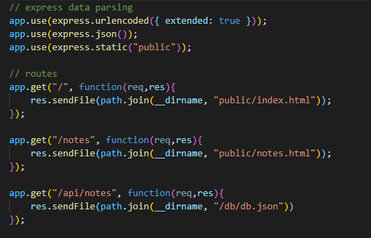

<h1 style="text-align: center;">Note-To-Self</h1>

## Table of Contents

- [Table of Contents](#table-of-contents)
- [Description](#description)
- [What is the basic use of this application?](#what-is-the-basic-use-of-this-application)
- [Who worked on this proyect?](#who-worked-on-this-proyect)
- [What technologies were used for this application?](#what-technologies-were-used-for-this-application)
- [How can this application be tested?](#how-can-this-application-be-tested)
- [Images](#images)
- [Questions? How can we get in contact with you?](#questions-how-can-we-get-in-contact-with-you)
- [License and Deployment](#license-and-deployment)

## Description

    This JS project creates an application that allows us to write notes for our busy schedules. It uses express to create a link between front and backend of the application.

## What is the basic use of this application?

    Lets you create new notes to keep up with your busy life. If you are a person who easily forgets things to do, this application can help you remember about picking up a gift for your wife's birthday which, thanks to this app, you REMEMBERED!

## Who worked on this proyect?

    Just myself for the moment, if you with to contribute or comment on my work, please contact me I'm always looking to improve upon my code.

## What technologies were used for this application?

    HTML CSS JAVASCRIPT EXPRESS UUID NODE HEROKU

## How can this application be tested?

    My app is deployed to heroku which I will provide a link for at the bottom of the page.

## Images

## Questions? How can we get in contact with you?

[GitHub:] https://github.com/Milan1422
[Email:] jmilan.gonzalez@gmail.com

## License and Deployment

Click on link to see license docs 

